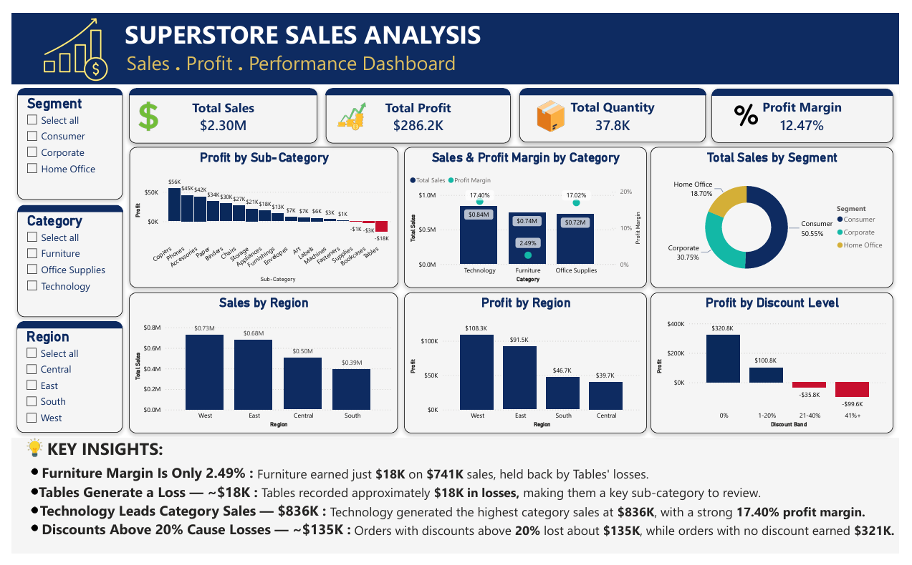

# Superstore Sales Analysis

End-to-end data analytics project on the Superstore sales dataset using **Python, SQL (PostgreSQL) and Power BI**: data cleaning, exploratory analysis, business-focused SQL analysis, an interactive dashboard, and actionable recommendations.



---

## Key Findings at a Glance

1. **Technology** is the best category: **$836K sales**, **$145K profit**, **17.40% margin**.
2. **Furniture** has almost the same sales as Office Supplies ($741K) but only a **2.49% margin**, mainly because of **Tables** (-$17.7K).
3. **Discounts above 20% always lose money**: about **$135K in total losses**, while orders with no discount earned **$321K**.
4. **Central** region sells $501K but earns only $40K (**7.9% margin**), less profit than South ($47K) even though South sells less ($392K).
5. **Consumer** is the largest customer segment with **50.55%** of total sales.

---

## Business Overview

This project analyzes sales performance, profitability, product performance, customer segments, regional performance, and discount patterns to find where the business makes and loses money.

---

## Project Objectives

- Clean and validate the raw sales dataset
- Analyze overall sales and profitability
- Identify top-performing categories and sub-categories
- Analyze customer segment performance
- Compare regional sales and profitability
- Identify loss-making states and sub-categories
- Analyze profitability across discount ranges
- Identify high-sales but low-profit sub-categories
- Rank sub-categories by profitability within each category
- Build an interactive Power BI dashboard
- Generate actionable business insights

---

## Tools & Technologies

- **Python** (Pandas, Matplotlib, Jupyter Notebook)
- **SQL** (PostgreSQL)
- **Microsoft Excel**
- **Power BI** (DAX measures, slicers, conditional formatting)
- **Git & GitHub**

---

## Dataset

The project uses the Superstore sales dataset with these columns: Ship Mode, Segment, Country, City, State, Postal Code, Region, Category, Sub-Category, Sales, Quantity, Discount, Profit.

| Item | Value |
|---|---:|
| Original rows | 9,994 |
| Duplicate rows removed | 17 |
| Final cleaned rows | **9,977** |
| Columns | 13 |
| Missing values after cleaning | 0 |

**Limitations:** the dataset has no Order ID or Order Date, so averages are calculated per row (order line), and time-based trend analysis is not possible.

---

## Project Workflow

### 1. Data Cleaning
Loaded the raw CSV, inspected structure and data types, checked missing values, detected and removed duplicate rows, trimmed whitespace in text columns, validated the result, and exported the cleaned data to Excel and CSV.

Notebook: `notebooks/01_Data_Cleaning.ipynb`

### 2. Exploratory Data Analysis (Python)
Exploratory analysis of sales and profitability across:

- Category (sales, profit, margin)
- Region (sales, profit, margin)
- Customer segment (sales share, margin)
- Sub-category (profit, margin, loss-making items)
- Discount levels (profit by discount band)
- States (top states by sales and profit, loss-making states)

Notebook: `notebooks/02_Exploratory_Data_Analysis.ipynb`

### 3. SQL Business Analysis
The cleaned dataset was imported into PostgreSQL and **18 business queries** were written to analyze:

- Overall business KPIs
- Category performance and profit margins
- Sub-category profitability
- Regional performance
- Discount and profitability patterns (profit by discount band, impact of discounts above 20%)
- Top-performing and loss-making states
- Customer segments
- Top-performing cities and top-selling cities that lose money
- High-sales but low-profit sub-categories
- Category contribution to total sales
- Sub-category profitability rankings

SQL techniques used: `SELECT`, `WHERE`, `GROUP BY`, `ORDER BY`, aggregate functions, `CASE WHEN`, `HAVING`, `NULLIF`, CTEs, window functions, `RANK()`.

SQL file: `SQL/superstore_analysis.sql`

### 4. Business Sales Analysis
Summary analysis of category, segment, sub-category, and region performance, plus loss-making sub-categories and the top 10 cities by sales.

Notebook: `notebooks/03_Sales_Analysis.ipynb`

### 5. Power BI Dashboard
An interactive dashboard that presents the final business insights.

**KPI cards:** Total Sales, Total Profit, Total Quantity, Profit Margin

**Slicers:** Segment, Category, Region

**Charts:**
- Profit by Sub-Category (losses highlighted in red)
- Sales & Profit Margin by Category
- Total Sales by Segment
- Sales by Region
- Profit by Region
- Profit by Discount Level

**Key Insights panel** with four headline findings.

Power BI file: `Dashboard/Superstore_Sales_Analysis.pbix`

---

## Key Business Metrics

| Metric | Value |
|---|---:|
| Total Sales | **$2,296,195.59** |
| Total Profit | **$286,241.42** |
| Total Quantity | **37,820** |
| Average Discount | **15.63%** |
| Profit Margin | **12.47%** |

*These figures are identical in the Python notebooks, the SQL queries, and the Power BI dashboard.*

---

## Category Performance

| Category | Sales | Profit | Profit Margin |
|---|---:|---:|---:|
| Technology | $836,154.03 | $145,454.95 | 17.40% |
| Furniture | $741,306.31 | $18,421.81 | 2.49% |
| Office Supplies | $718,735.24 | $122,364.66 | 17.02% |

---

## Key Business Insights

### Category Performance
- **Technology** generated the highest sales and profit.
- **Furniture** generated substantial sales but only a **2.49%** margin.
- **Office Supplies** was strongly profitable with a **17.02%** margin.

### Sub-Category Performance
- **Copiers** generated the highest profit (about **$55.6K**).
- **Phones** generated about **$330K in sales** and **$44.5K in profit**.
- **Tables** generated about **$207K in sales but lost $17.7K** (-8.56% margin), the biggest loss of any sub-category.
- **Bookcases** (-$3.5K) and **Supplies** (-$1.2K) also lost money.

### Customer Segments
- **Consumer** contributes **50.55%** of sales, followed by **Corporate (30.75%)** and **Home Office (18.70%)**.
- **Home Office** has the highest margin (about 14.0%), while **Consumer**, the largest segment, has the lowest (about 11.5%).

### Regional Performance
- **West** leads in sales ($725K) and profit ($108K), followed by **East** ($678K sales, $92K profit).
- **Central** sells more than South ($501K vs $392K) but earns less profit ($40K vs $47K), a **7.9%** margin compared with South's 11.9%. Higher sales do not always mean higher profit.

### Discount Analysis
- Orders with **no discount** earned **$321K** and 1-20% discounts earned **$101K**.
- **Every discount above 20% lost money**: the 21-40% band lost **$36K** and the 41%+ band lost **$100K**, about **$135K in total**.
- Orders with **no discount** earned a **29.51%** margin, while orders with discounts above 20% had a **-37.34%** margin. These orders are only about 15.8% of total sales but caused about $135K in losses.
- The **41%+ discount range** generated about $128.6K in sales but a loss of $99.6K.

### State Performance
- **California** generated the highest state-level profit, followed by **New York** and **Washington**.
- **Texas** was the largest loss-making state, with about **$170K in sales and a $25.8K loss**.
- **10 states** lose money overall, with a combined loss of about **$98K**. **Texas, Ohio, Pennsylvania and Illinois** account for about $71K of it.
- **4 of the top 10 cities by sales lose money**: Philadelphia (-$13.8K), Houston (-$10.2K), Chicago (-$6.6K) and Jacksonville (-$2.3K).

### Advanced SQL Findings
- **Tables** is a high-sales but loss-making sub-category.
- **Machines** is a high-sales but low-profit sub-category.
- **Technology** contributes about **36.41%** of total sales.
- **Copiers** rank #1 in profit within Technology, **Chairs** within Furniture, and **Paper** within Office Supplies.

---

## Business Recommendations

1. **Cap discounts at about 20%.** Discounts above this level lost roughly $135K, almost half of the total profit.
2. **Investigate Tables** (pricing, discounts, and costs), since it drives Furniture's low margin.
3. **Review Bookcases and Supplies**, which also lose money.
4. **Investigate Central region** to find out why sales convert into less profit than in other regions.
5. **Investigate loss-making states** such as Texas, Ohio, Pennsylvania, and Illinois.
6. **Protect and grow Technology and Office Supplies**, which have the best margins.
7. **Analyze high-sales, low-profit sub-categories** such as Machines for margin improvement.
8. **Evaluate performance using profit and margin together**, not sales alone.

---

## Project Structure

```text
Superstore-Sales-Analysis/
│
├── data/
│   ├── Raw/
│   │   └── SampleSuperstore.csv
│   │
│   └── Cleaned/
│       ├── Superstore_Cleaned.xlsx
│       └── Superstore_Cleaned.csv
│
├── notebooks/
│   ├── 01_Data_Cleaning.ipynb
│   ├── 02_Exploratory_Data_Analysis.ipynb
│   └── 03_Sales_Analysis.ipynb
│
├── SQL/
│   └── superstore_analysis.sql
│
├── Dashboard/
│   ├── Superstore_Sales_Analysis.pbix
│   └── Superstore_Sales_Analysis.pdf
│
├── images/
│   └── dashboard.png
│
├── README.md
│
└── .gitignore
```

---

## How to Run

1. Clone the repository.
2. Install the requirements: `pip install pandas matplotlib openpyxl jupyter`
3. Run the notebooks in order (`01` → `02` → `03`) from the `notebooks/` folder.
4. In PostgreSQL, run Section 0 of `SQL/superstore_analysis.sql` to create the table, import `data/Cleaned/Superstore_Cleaned.csv` into it, then run the queries one by one.
5. Open `dashboard/Superstore_Sales_Analysis.pbix` in Power BI Desktop.

---

## Author

**Nadar Ali**
Aspiring Data Analyst | Python, SQL, Power BI
[LinkedIn](https://www.linkedin.com/in/nadar-ali-aa45513b5) | [GitHub](https://github.com/Nadar-Hub)
